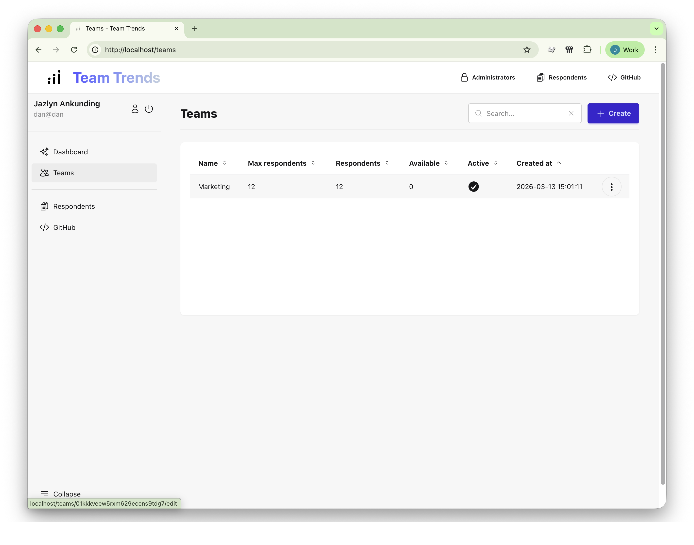
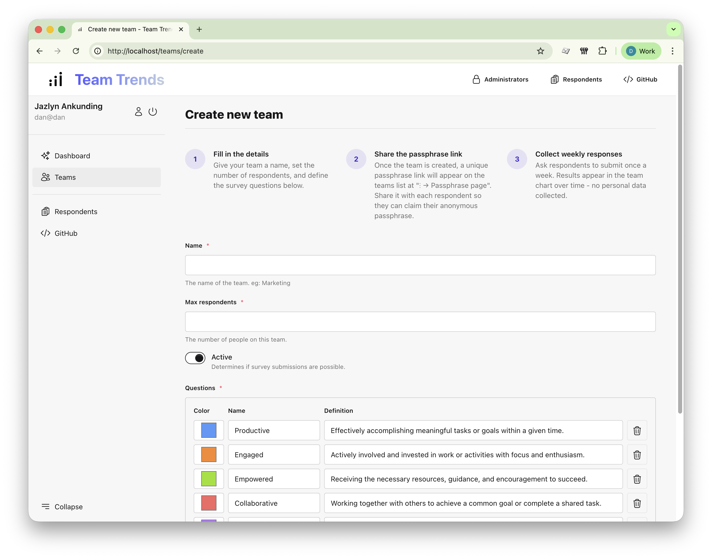
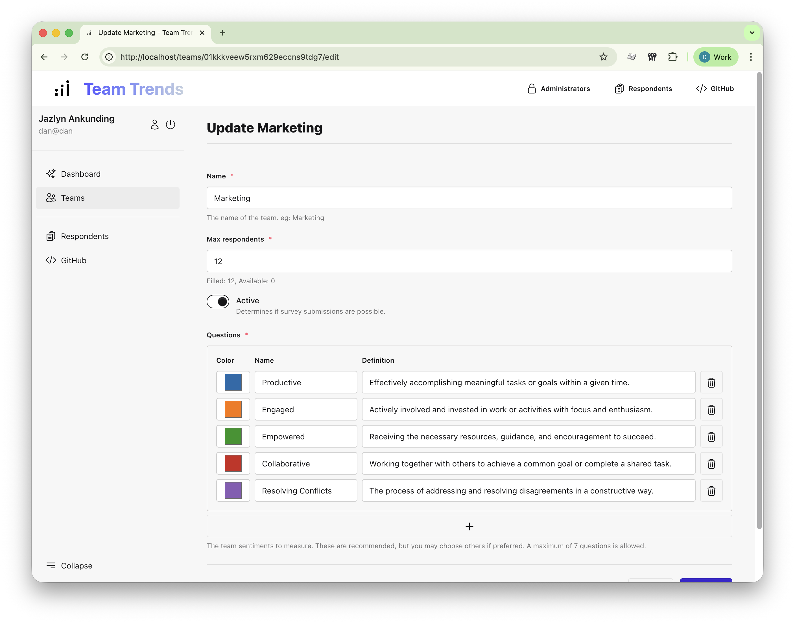
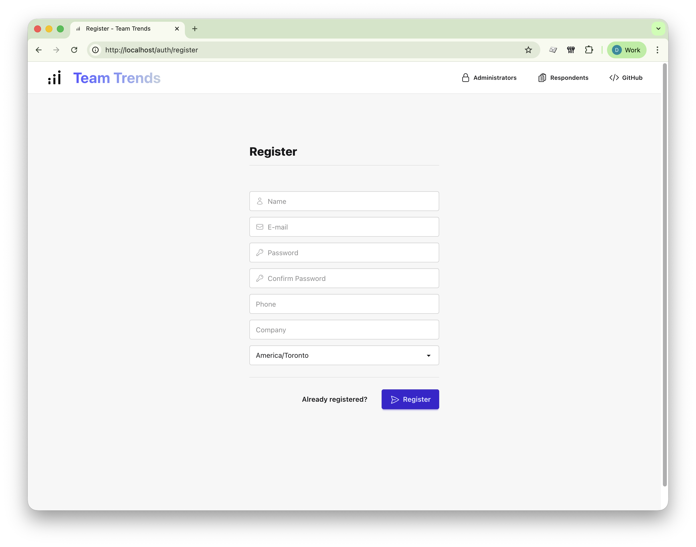
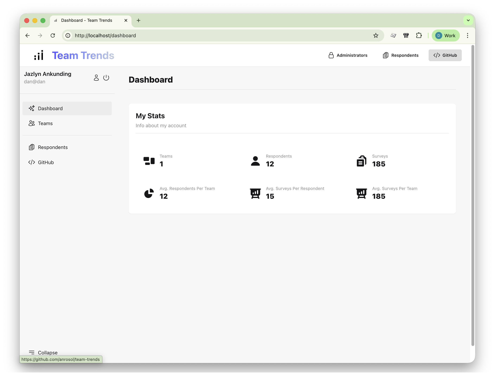
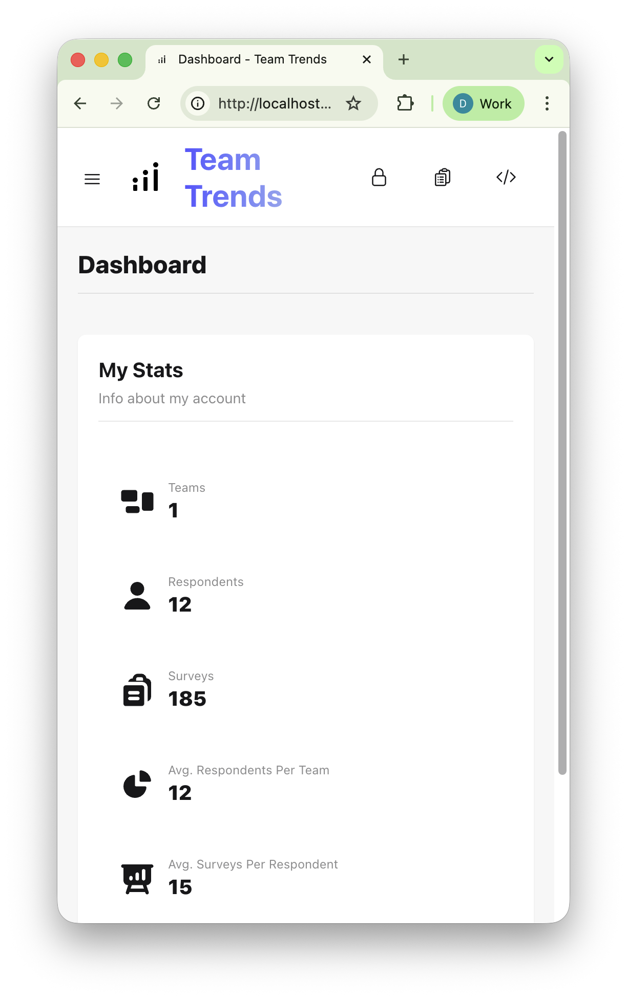
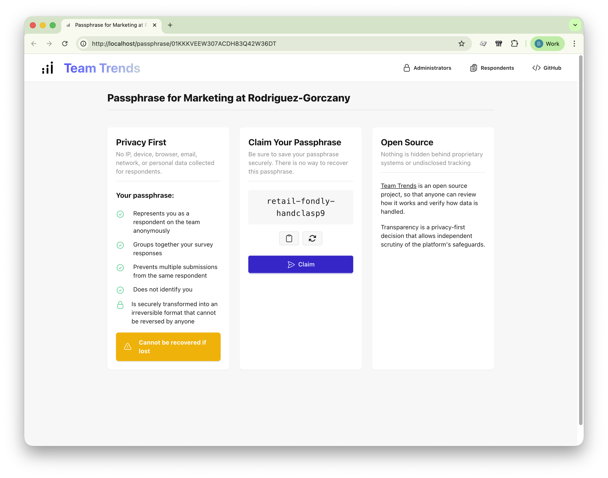
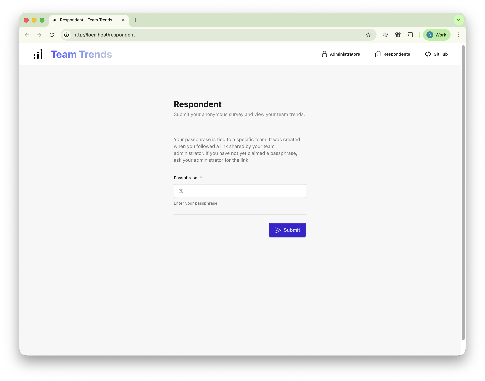
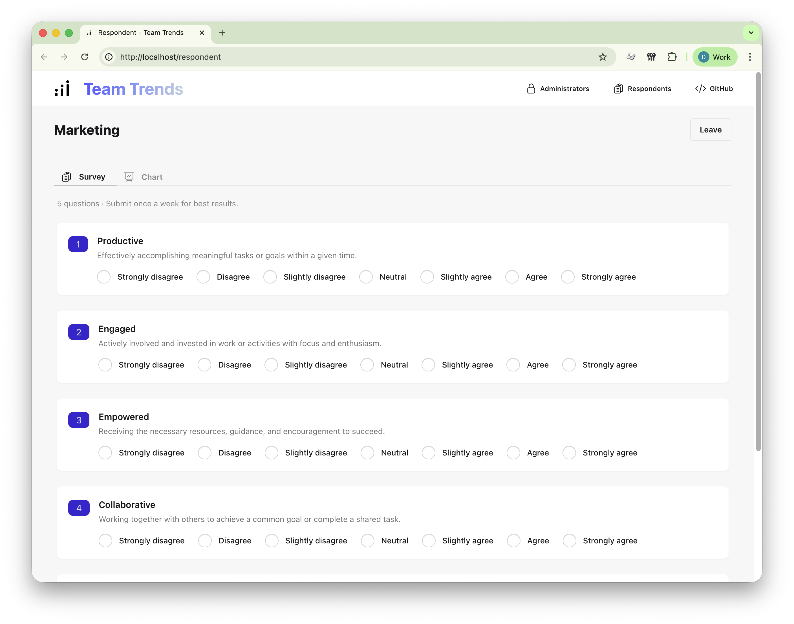
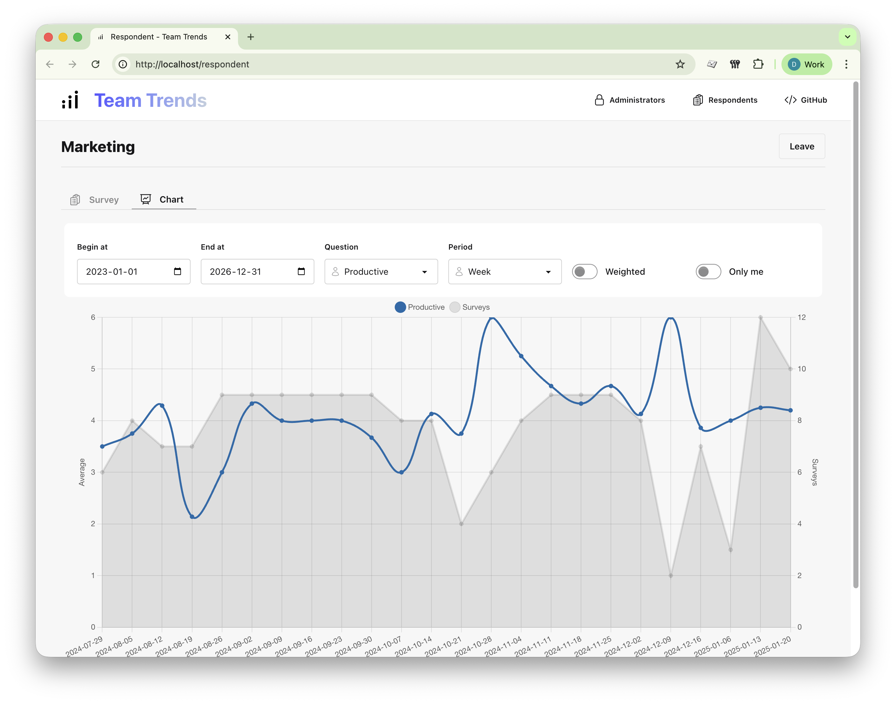

# Team Trends

- [Trust is measurable](#trust-is-measurable)
- [Screenshots](#screenshots)
- [Mission](#mission)
- [Privacy Guarantees](#privacy-guarantees)
- [Security Model](#security-model)
- [Architecture](#architecture)
- [Why Open Source?](#why-open-source)
- [Production Deployment Guide](#production-deployment-guide)
- [Version Transparency](#version-transparency)
- [Team Trends Cloud](#team-trends-cloud)
- [License](#license)
- [A Note to Leaders](#a-note-to-leaders)

## Trust is measurable.

Team Trends is a privacy-first web application designed to help leaders measure team sentiment without compromising anonymity.

Instead of accounts, emails, or tracking, respondents use non-identifying passphrases. This allows organizations to surface meaningful trends over time while preserving psychological safety.

Team Trends is fully open source and built on a simple principle:

> Feedback only works when trust is preserved.

## Screenshots

### Admin

<table>
  <tr>
    <td align="center"><strong>Teams</strong><br><a href="docs/screenshots/teams-index.png"></a></td>
    <td align="center"><strong>Create Team</strong><br><a href="docs/screenshots/teams-create.png"></a></td>
  </tr>
  <tr>
    <td align="center"><strong>Edit Team</strong><br><a href="docs/screenshots/teams-edit.png"></a></td>
    <td align="center"><strong>Registration</strong><br><a href="docs/screenshots/register.png"></a></td>
  </tr>
  <tr>
    <td align="center"><strong>Dashboard</strong><br><a href="docs/screenshots/dashboard-desktop.png"></a></td>
    <td align="center"><strong>Mobile Friendly</strong><br><a href="docs/screenshots/dashboard-mobile.png"></a></td>
  </tr>
</table>

### Respondent

<table>
  <tr>
    <td align="center"><strong>Claim Passphrase</strong><br><a href="docs/screenshots/passphrase-claim.png"></a></td>
    <td align="center"><strong>Passphrase Login</strong><br><a href="docs/screenshots/respondent-login.png"></a></td>
  </tr>
  <tr>
    <td align="center"><strong>Survey</strong><br><a href="docs/screenshots/respondent-survey.png"></a></td>
    <td align="center"><strong>Chart</strong><br><a href="docs/screenshots/respondent-chart.png"></a></td>
  </tr>
</table>

## Mission

To provide leaders with a transparent, privacy-respecting system for measuring team sentiment - without surveillance, behavioral tracking, or personal data collection.

Team Trends exists to support trust-centered leadership, not growth hacks or engagement metrics.

Respondents submit a short **weekly** pulse survey using a non-identifying passphrase. Over time, the chart reveals trends that inform leadership decisions without exposing individual responses.

## Privacy Guarantees

While administrator accounts require name, email and other details, Team Trends is intentionally minimal for respondents.

- No respondent accounts
- No respondent email collection
- No respondent personal identifiers
- No respondent behavioral tracking
- No respondent hidden analytics
- No respondent third-party tracking scripts
- No respondent fingerprinting
- No respondent cookies used (except for passphrase creation)

Respondents are identified only by non-identifying passphrases.

The system is designed to measure trends - not people.

## Security Model

Team Trends follows a simple security philosophy:

### 1. Minimize Data Collection
The most secure data is data that does not exist.

### 2. Separate Identity from Sentiment
Passphrases are non-identifying and cannot be used to infer personal identity.

### 3. Encrypted Responses
Sensitive response data is encrypted at rest using the application key.

### 4. Hashed Passphrases
All passphrases are securely hashed using a strong, one-way hashing algorithm before storage. Even if the database is compromised, passphrases cannot be reversed to identify users.

## Architecture

- Laravel
- Docker-based local development
- No external SaaS dependencies required
- Compatible with common SMTP providers

Team Trends is designed to be simple to audit, deploy, and reason about.

## Why Open Source?

Trust cannot be claimed - it must be verifiable.

By making the code public:

- Organizations can audit how data is handled
- Developers can verify there is no tracking
- Teams can deploy and control their own instance
- Leaders can demonstrate transparency to their people


## Production Deployment Guide

1. Setup a laravel server that is consistent with Laravel's [server requirements](https://laravel.com/docs/deployment). Consider using a project like [VitoDeploy](https://vitodeploy.com) (free) or [Laravel Forge](https://forge.laravel.com/) (paid).

1. Clone the project and setup dependencies

```bash
git clone https://github.com/anrosol/team-trends.git
cd team-trends
composer install --no-dev --prefer-dist --optimize-autoloader
cp .env.example .env
php artisan key:generate
```

1. Set `APP_*` values in `.env`

```bash
APP_ENV=production
APP_DEBUG=false
APP_URL=[CHANGE]
```

1. Set `DB_*` values in `.env`

```bash
DB_CONNECTION=mariadb
DB_HOST=127.0.0.1
DB_PORT=3306
DB_DATABASE=team_trends
DB_USERNAME=[CHANGE]
DB_PASSWORD=[CHANGE]
```

1. Set `MAIL_*` values in `.env`

To create an administrator account, email must be configured.

Team Trends supports:

* SMTP
* Mailgun
* Postmark
* Resend
* Amazon SES
* sendmail

Laravel mail configuration guide:
[https://laravel.com/docs/mail#configuration](https://laravel.com/docs/mail#configuration)

```bash
MAIL_MAILER=smtp
MAIL_SCHEME=null
MAIL_HOST=[CHANGE]
MAIL_PORT=[CHANGE]
MAIL_USERNAME=[CHANGE]
MAIL_PASSWORD=[CHANGE]
MAIL_FROM_ADDRESS="[CHANGE]"
MAIL_FROM_NAME="${APP_NAME}"
```

1. Set `PASSPHRASE_PEPPER` in `.env`

```bash
# PASSPHRASE_PEPPER is a security-critical value.
# It must be set before any passphrases are created.
# Changing it will invalidate all existing passphrases.
# Losing this value makes it impossible for respondents to take new surveys or see charts.
# Run `openssl rand -hex 32` to retrieve a suitable value.
PASSPHRASE_PEPPER=[CHANGE]
```

1. And finally, deploy the app by calling `bash deploys.sh` at the root of your project.

## Version Transparency

Every release of Team Trends is tagged and publicly available.

To verify your deployment:

1. Check the version number in your application footer.
2. Compare the commit hash to the corresponding GitHub tag.
3. Confirm the tagged release matches your deployed code.

## Team Trends Cloud

Prefer not to self-host?

Setup your team on Team Trends Cloud:

[https://team-trends.com](https://team-trends.com)

Team Trends Cloud runs the latest tagged release of this repository.

---

## License

Team Trends is open source software licensed under the MIT License.

You are free to use, modify, distribute, and deploy this software in both private and commercial environments.

See the [LICENSE](LICENSE) file for full details.

---

## A Note to Leaders

Team Trends is not a surveillance tool.

It is an instrument for measuring alignment, morale, and tension safely.

When people know they are not being tracked, their responses become more honest.

When responses are honest, leadership decisions become clearer.

---

Created by [Anrosol](https://anrosol.com).